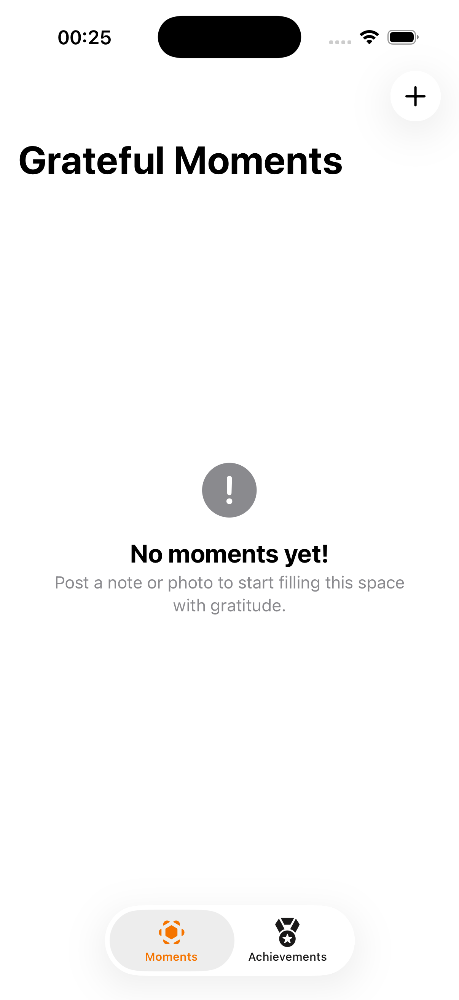
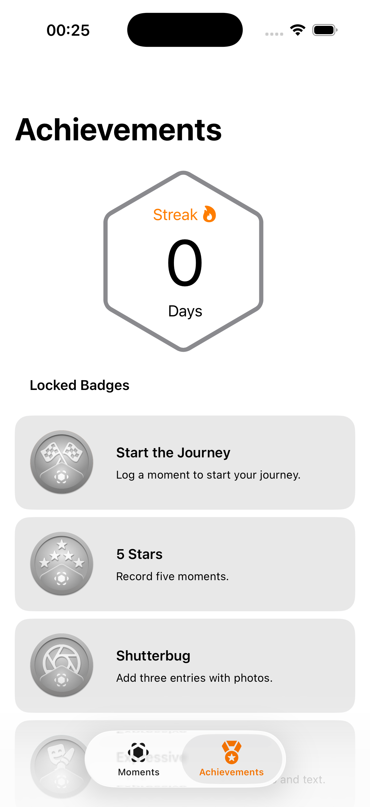
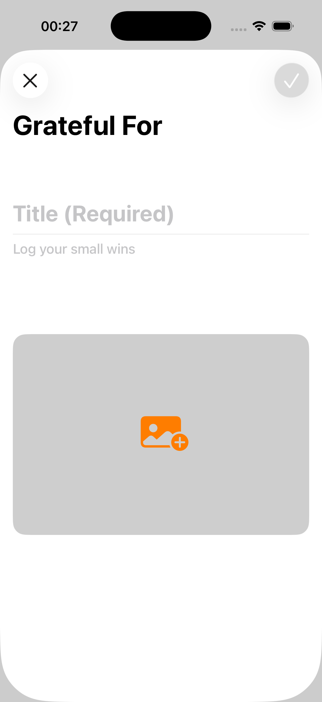
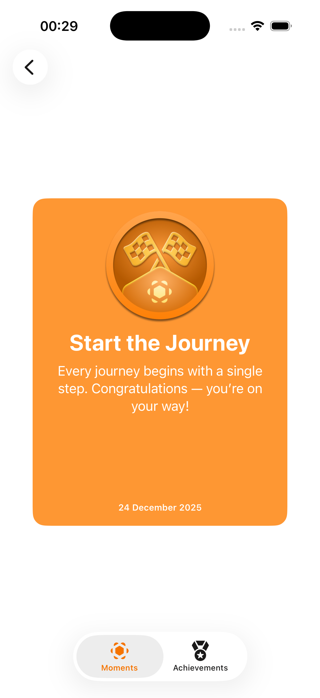

# GratefulMoments 🙏🏾✨

| Moments        | Achievements   | Moment Page    |
|----------------|----------------|----------------|
|  |  |  |

**SwiftUI**

Diary app to share your greateful moments.

## ✨ Features
- Badges
- Create moments with photos
- Streak calculator

## 🧱 Architecture
- **Layers**: `Models`, `Logic`, `Tabs`, `Views`, `Custom Views`

## 🛠️ Stack
Swift 6 • SwiftUI • SwiftData • Xcode 26 • iOS 26

## 🚀 How to Run
1. `git clone https://github.com/Luizgustavo358/GratefulMoments.git`
2. Open `GratefulMoments.xcodeproj` / `xcworkspace`
3. Run in iPhone/iPad

## Course Link

- [Apple Developer](https://developer.apple.com/tutorials/develop-in-swift/welcome-to-app-development)

## Made by:

- [Luiz Gustavo Bragança dos Santos](https://github.com/Luizgustavo358)

## 📸 Screenshots

| Main Page      | Achievements   | Add Moment     | Adding Moment  |
|----------------|----------------|----------------|----------------|
|  |  |  |  |

| Main Page with moment | Moment Page    | Badge Description | Achievements with unlocked badge |
|-----------------------|----------------|-------------------|----------------------------------|
|         |  |     |                    |

---

## 🗺️ Roadmap
- [X] Light/Dark Mode
- [X] Tests
- [ ] Widget
- [ ] UI tests (XCTest)

## 📄 Licence
MIT